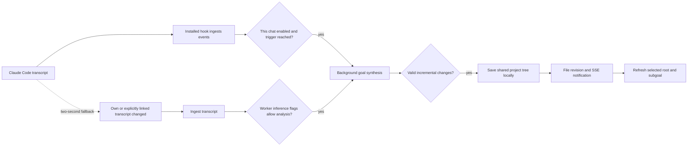

# Engelbart: workspace behavior and goal synchronization

Reviewed September 9, 2026 against Engelbart **0.20.4**, runtime commit `d82f5f43c1ac7137941b8596f9018833e15e7fbe`. This describes the Standard interface and installed Claude Code integration. Source links are pinned to that revision. Findings labeled **code-confirmed gaps** follow from the implementation; they were not reproduced by changing a user's working project.

## What the three tabs actually do

| Tab | What it displays | What persists |
| --- | --- | --- |
| Live preview | A running project's web UI inside an iframe, with startup and failure states | Project run configuration/logs; process identity for the Node server manager |
| Terminal | Read-only build activity for the selected subgoal, plus project preview command/output | Build activity files and project run logs |
| Dataset | The active imported dataset's metadata and a bounded sample | Local resource files/manifests and the project's active dataset selection |

**The Terminal tab is not an interactive shell or a Claude chat. Dataset is not a complete spreadsheet application.** Live preview and Dataset belong to the project; the build portion of Terminal belongs to the selected subgoal. [Pane assembly][panes], [Terminal component][terminal-component], [Dataset component][dataset-component].

## Live preview

The Engelbart server and the app it previews are separate processes and usually have different ports. Engelbart determines a project directory from the bound project/session, canonicalizes its repository location, and uses the project's saved working directory when present. Its runner detects supported scripts and build files: package scripts and lockfiles, Makefiles, Procfiles, Python/Rust/Go projects, and static HTML. Run configuration is stored beside the project record in a `.run.json` file. A fingerprint allows changed build files to invalidate stale detection. [Directory selection][preview-directory], [Run configuration][preview-config].

A workspace refresh can automatically try to start a deterministically detected web app when its preview state is unconfigured, ready, or stale with no active build and no unmet installation or setup blockers. This is not restricted to commands previously run successfully. Automatic startup excludes model guesses and honors an explicit saved `autostart: false`. Some comments still describe click-only startup; the current callers and guards implement the behavior above. [Automatic startup caller][preview-auto], [Startup guards][preview-show].

“Find how to run it” performs deterministic configuration first. If that cannot identify a profile, configuration can ask a model for help. “Show UI” can run the necessary detected installation commands before the server. “Run” starts a profile directly. Node development servers can be owned by the persistent development-server manager; other commands use the preview process runner, whose in-memory process registry belongs to the running Engelbart UI server. Persistent process adoption after a UI-server restart is a Node-manager capability. A browser refresh does not itself terminate the app. Explicit Stop disables autostart and stops the owned process group. [Configuration][preview-configure], [Process runner][preview-process], [Stop][preview-stop].

The runner reads output for a URL and probes that address with HTTP requests. The UI receives a healthy address, rather than assuming that a process starting means its page is ready. It then mounts an iframe keyed by that URL. During a build or a failed acceptance gate, Standard replaces the iframe with a status view. No detected web command, a failed process, or a startup that produces no address gets an explanatory state; Show UI can report `not_ready` after 75 seconds without an announced URL. A discovered but unhealthy address can instead remain in a running/output state. [URL/probe logic][preview-probe], [Standard iframe][preview-component].

Two code-confirmed gaps matter:

- **Different build and preview directories:** a build respects a goal or ancestor's `project_cwd` override. Preview resolves only the project's working directory. A cross-project goal can therefore build in one directory while previewing another. Ordinary same-project goals do not encounter this mismatch. [Build directory][build-directory], [Preview directory][preview-directory].
- **Blocked embedding:** the runner checks frame restrictions such as `X-Frame-Options` and CSP, but Standard's iframe component does not use that result to offer an alternative. A healthy app that prohibits embedding can appear as a blocked/empty frame. [Probe][preview-probe], [Iframe][preview-component].

## Terminal

Selecting Terminal reads activity; it does not start a terminal session, resume the original Claude conversation, or accept keyboard commands. The blinking `$` is a live-status decoration. The component renders a filtered projection of builder events, plus the preview process's command and output. Activity is cached on disk in the chat's `builds/` directory, including `<goal>.activity.json` and related logs. Switching tabs or reloading reads these records again. [Terminal component][terminal-component], [Activity projection][terminal-projection], [Activity storage][build-activity].

Clicking **Build** elsewhere is what normally launches a separate headless Claude Code process. Its command includes `claude -p`, a composed build prompt, stream-JSON output, `acceptEdits`, and a builder session ID; a repair can resume that builder conversation. Its stdin is disconnected, stdout is captured, and stderr is logged. This is a different conversation from the terminal chat in which the user typed `/bart`. [Builder command and spawn][builder-command].

The normal build model comes from the build setting/environment policy, with Sonnet as the default; quick builds have their own lane settings. Goal synthesis uses a separate model setting. Internal Claude calls receive `HC_CHAT_INFERENCE=1`, which prevents their hooks from recursively importing their own work. The default provider environment removes API-key/token overrides unless explicit API-key mode is enabled; the user's Claude configuration and helpers can still affect authentication. [Build mode][build-mode], [Provider environment][provider-env], [Synthesis provider][synthesis-provider].

There is also a session-mode build path that hands work to a hooked Claude conversation. That is a build-mode alternative, not an interactive feature of the Standard Terminal tab. [Build mode][build-mode].

## Dataset

The main workspace's uploader is **local**. It starts an import manifest, sends each file's bytes to the loopback server, and finishes the collection. A browser folder selection follows that same upload path. Files land under the project directory's `.engelbart-resources/import-<id>/`, alongside import metadata and a manifest; this resource directory is added to `.gitignore`. The backend validates paths, symlinks, and declared sizes, and records content hashes. The local browser upload does not supply an expected hash for comparison; approved remote acquisition separately validates pinned checksums. Limits include 5,000 files, 1 GiB per file, and 8 GiB total. [Upload client][dataset-upload], [Local import backend][dataset-import].

“Choose local folder” uses a different native path: it references the existing directory and writes collection metadata instead of copying or moving the original files. The browser folder picker copies bytes. [Native folder linking][dataset-link].

The active dataset changes only after the completed import has usable inspected data. A failed import preserves the previous active dataset. Identical content can be deduplicated. Failed browser uploads cancel staging; unfinished uploads do not automatically resume after a reload. Old unreferenced staging is cleaned during later imports. [Import completion][dataset-finish].

A bound project is sufficient, but the upload endpoint can also use the chat manifest's actual working directory. A completely missing project directory produces an error. Shared/public viewers cannot use the local import endpoint. [Endpoint restrictions and directory resolution][dataset-endpoint].

Inspection supports CSV, TSV, Parquet, XLSX, JSON, JSONL, and NDJSON. The UI lists up to 12 table paths and shows a sample of the primary table: at most 10 rows, 20 columns, and 240 characters per cell. It has no table-switching browser, pagination, editing, or query interface. The underlying manifest can include more files than the UI displays. [Dataset component][dataset-component], [Resource inspection][resource-inspection].

Hosted onboarding is a separate route: it uploads to Supabase through signed upload URLs, stores a source manifest, and later lets the installed client acquire the approved resource into the project. Describing the main workspace's loopback upload as “saving the files to Supabase” would be incorrect. [Hosted upload implementation][hosted-dataset], [Installed acquisition][dataset-acquire].

## Running `/bart` in an existing Claude Code chat

1. The installed command hook receives the invoking chat's session ID and working directory. It ingests the existing transcript incrementally, including event data used to bridge transcript flush delays.
2. `/bart` persists that chat's opt-in to goals, clears its disabled flag, and opens the workspace. It can claim an approved onboarding setup and bind the chat to a project. If no project is resolved, project selection/onboarding is needed.
3. Explicitly bound chats can share the project's goal tree. Being in the same directory alone is not the same as that explicit binding.
4. A healthy server for that project can be reused even if another chat originally opened it. Outdated idle servers are replaced; a live build prevents replacement beneath that work.
5. The command requests background goal analysis for the **invoking chat**. Existing goals stay in place while new transcript evidence is considered.

[Hook adapter and command dispatch][hook-dispatch], [Workspace launch][bart-launch], [Analysis request on launch][bart-refresh].

**Existing chat history can therefore produce goals after `/bart`; it is not limited to future messages.** This is asynchronous model inference, not a synchronous guarantee that opening the page creates a complete plan. The terminal conversation also does not become the Bart chat log: the workspace's Bart messages have a separate per-subgoal store.

With the installed hook active, `/bart` opens the page and ends the command without a normal Claude model response. A resumed session may still have old hook configuration; the skill's fallback opens the workspace through `hc chat-ui`. A fresh Claude session loads the current hooks. Bare `bart` entered in a shell is a different command: it opens the Projects view rather than automatically attaching to an arbitrary current chat. [Command handling][hook-dispatch], [Bare launcher][bare-bart].

Closing the browser does not undo the chat's opt-in. `/bart disable` disables hook injection and normal hook-triggered inference until reopening. The follower inconsistency below is an exception in the current code.

## Why goals from terminal Claude Code appear only sometimes

### Recording, analysis, and display are different operations

An installed hook can record a chat without enabling analysis. `/bart` enables that particular chat; another chat in the same project is not automatically opted in.

Normal hook-triggered synthesis runs on **Stop, TaskCompleted, PostCompact, and SessionEnd**, after checking whether goals are active. UserPromptSubmit records the prompt and injects cached context but does not directly start synthesis. SessionStart/SubagentStart inject full cached context; prompt/post-tool injection uses cached deltas. `/bart` itself explicitly requests analysis. There is no fixed debounce timer: requested transcript ordinals and a worker lease coalesce work into one analyzer per session, with bounded passes and handoff. [Installed events][hook-events], [Hook gates][hook-dispatch], [Worker scheduling][synthesis-worker].

Claude Code's `TaskCreate`/`TodoWrite` list is **not copied verbatim into the project goal tree**. Execution-plan observation and goal synthesis are distinct paths. The synthesis prompt infers outcomes as goals and implementation steps as TODOs. Incremental changes are constrained; the model may legitimately produce no new goal, put something under an existing goal, or represent it as a TODO. Private thinking is not used, and transcript/context input is bounded. [Synthesis rules][synthesis-rules], [Transcript selection][synthesis-provider].

Synthesis invokes Claude separately, with its own provider/model configuration and a default 180-second timeout. Authentication failures, quota/network errors, a missing CLI, or invalid output can leave the ordinary chat and workspace running while analysis fails. The manifest's analyzer status and analyzer log carry the failure. Local saving uses revision checks so a concurrent edit cannot silently be overwritten. The local UI then learns of changes through disk revision watching and SSE; it does not wait for a Supabase round trip. [Synthesis execution][synthesis-worker], [UI event stream][ui-events], [Client updates][client-events].

### Conditions that make an update look absent

| Condition | Result |
| --- | --- |
| Chat was captured but never enabled through `/bart` | Transcript data exists without normal goal synthesis |
| A synthesis trigger has not occurred yet, or its worker is still running | The UI continues showing the previous tree |
| Claude inferred steps or found no justified change | No new root goal appears; TODOs or an existing goal may change |
| Different project/session binding or state directory | The update is written somewhere other than the workspace being viewed |
| Different selected root/subgoal, or archived content | The current pane does not show that part of the tree |
| Analyzer error or timeout | New transcript evidence has not been applied |
| Hook absent or stale in a resumed Claude session | Normal ingest/trigger behavior may be missing |

### Code-confirmed gaps in 0.20.4

These are implementation findings, not a claim that each caused a particular observed incident.

1. **The fallback follower does not cover every chat in a project.** It scans the server's own session and explicit `linked_chats`, not all project members. If chat B reuses a server opened for A and B's hooks are missing/stale, the fallback may follow A without catching B. Correctly running hooks still update the shared project tree. A synthetic project-tree session having no transcript is normal by itself. [Follower targets][transcript-follower].
2. **An unchanged transcript is not automatically retried after every failure.** The follower records its seen file mark before requesting analysis; it swallows a worker-start error. The next tick skips unchanged bytes. Model failures also retain the old analysis cursor without scheduling automatic backoff. Another transcript change or explicit `/bart` can trigger another attempt. [Follower request][transcript-follower], [Worker failure handling][synthesis-worker].
3. **An already-running follower can bypass `/bart disable`'s intended analysis scope.** Hook dispatch checks whether goals are active. The follower's request path does not make that same check, and the worker's environment/inference-off checks are not equivalent. Hook context injection is disabled correctly. [Hook gate][hook-dispatch], [Follower][transcript-follower], [Worker gate][synthesis-worker].
4. **Standard exposes less hierarchy than the stored tree allows.** Its selected-root response makes subgoal slices only for direct, nonarchived children. Root-level `todo_items` and grandchildren's lists can exist on disk without a corresponding selected-subgoal pane. A saved change can therefore look missing without an ingestion or synchronization failure. [Standard tree projection][standard-projection].

For a concrete missing update, the useful diagnostic sequence is: identify the invoking chat and bound project; check that chat's opt-in and analyzer status/cursor; inspect whether the shared tree actually changed; then check which root/subgoal the UI is displaying. Repeatedly refreshing the browser cannot repair an analyzer failure or expose hierarchy that the renderer does not include.

[panes]: https://github.com/divadbaroon/claude-plugins/blob/d82f5f43c1ac7137941b8596f9018833e15e7fbe/hc/src/human_compact/trajectory/ui.py#L682
[terminal-component]: https://github.com/divadbaroon/claude-plugins/blob/d82f5f43c1ac7137941b8596f9018833e15e7fbe/hc/src/human_compact/trajectory/web/goal/components/terminal.js#L9
[dataset-component]: https://github.com/divadbaroon/claude-plugins/blob/d82f5f43c1ac7137941b8596f9018833e15e7fbe/hc/src/human_compact/trajectory/web/goal/components/resources.js#L17
[preview-directory]: https://github.com/divadbaroon/claude-plugins/blob/d82f5f43c1ac7137941b8596f9018833e15e7fbe/hc/src/human_compact/trajectory/ui.py#L3472
[preview-config]: https://github.com/divadbaroon/claude-plugins/blob/d82f5f43c1ac7137941b8596f9018833e15e7fbe/hc/src/human_compact/trajectory/preview.py#L150
[preview-auto]: https://github.com/divadbaroon/claude-plugins/blob/d82f5f43c1ac7137941b8596f9018833e15e7fbe/hc/src/human_compact/trajectory/web/goal/actions.js#L265
[preview-show]: https://github.com/divadbaroon/claude-plugins/blob/d82f5f43c1ac7137941b8596f9018833e15e7fbe/hc/src/human_compact/trajectory/preview.py#L845
[preview-configure]: https://github.com/divadbaroon/claude-plugins/blob/d82f5f43c1ac7137941b8596f9018833e15e7fbe/hc/src/human_compact/trajectory/preview.py#L1176
[preview-process]: https://github.com/divadbaroon/claude-plugins/blob/d82f5f43c1ac7137941b8596f9018833e15e7fbe/hc/src/human_compact/trajectory/preview.py#L526
[preview-stop]: https://github.com/divadbaroon/claude-plugins/blob/d82f5f43c1ac7137941b8596f9018833e15e7fbe/hc/src/human_compact/trajectory/preview.py#L917
[preview-probe]: https://github.com/divadbaroon/claude-plugins/blob/d82f5f43c1ac7137941b8596f9018833e15e7fbe/hc/src/human_compact/trajectory/preview.py#L664
[preview-component]: https://github.com/divadbaroon/claude-plugins/blob/d82f5f43c1ac7137941b8596f9018833e15e7fbe/hc/src/human_compact/trajectory/web/goal/components/preview.js#L28
[build-directory]: https://github.com/divadbaroon/claude-plugins/blob/d82f5f43c1ac7137941b8596f9018833e15e7fbe/hc/src/human_compact/trajectory/build.py#L1917
[terminal-projection]: https://github.com/divadbaroon/claude-plugins/blob/d82f5f43c1ac7137941b8596f9018833e15e7fbe/hc/src/human_compact/trajectory/agents/communication.py#L84
[build-activity]: https://github.com/divadbaroon/claude-plugins/blob/d82f5f43c1ac7137941b8596f9018833e15e7fbe/hc/src/human_compact/trajectory/build.py#L734
[builder-command]: https://github.com/divadbaroon/claude-plugins/blob/d82f5f43c1ac7137941b8596f9018833e15e7fbe/hc/src/human_compact/trajectory/build.py#L1397
[build-mode]: https://github.com/divadbaroon/claude-plugins/blob/d82f5f43c1ac7137941b8596f9018833e15e7fbe/hc/src/human_compact/trajectory/build.py#L396
[provider-env]: https://github.com/divadbaroon/claude-plugins/blob/d82f5f43c1ac7137941b8596f9018833e15e7fbe/hc/src/human_compact/trajectory/providers.py#L150
[synthesis-provider]: https://github.com/divadbaroon/claude-plugins/blob/d82f5f43c1ac7137941b8596f9018833e15e7fbe/hc/src/human_compact/trajectory/chat_synth.py#L370
[dataset-upload]: https://github.com/divadbaroon/claude-plugins/blob/d82f5f43c1ac7137941b8596f9018833e15e7fbe/hc/src/human_compact/trajectory/web/goal/services.js#L92
[dataset-import]: https://github.com/divadbaroon/claude-plugins/blob/d82f5f43c1ac7137941b8596f9018833e15e7fbe/hc/src/human_compact/trajectory/dataset_collections.py#L15
[dataset-link]: https://github.com/divadbaroon/claude-plugins/blob/d82f5f43c1ac7137941b8596f9018833e15e7fbe/hc/src/human_compact/trajectory/dataset_collections.py#L381
[dataset-finish]: https://github.com/divadbaroon/claude-plugins/blob/d82f5f43c1ac7137941b8596f9018833e15e7fbe/hc/src/human_compact/trajectory/dataset_collections.py#L189
[dataset-endpoint]: https://github.com/divadbaroon/claude-plugins/blob/d82f5f43c1ac7137941b8596f9018833e15e7fbe/hc/src/human_compact/trajectory/ui.py#L5916
[resource-inspection]: https://github.com/divadbaroon/claude-plugins/blob/d82f5f43c1ac7137941b8596f9018833e15e7fbe/hc/src/human_compact/trajectory/resources.py#L592
[hosted-dataset]: https://github.com/Mathetic-PBC/berkeley-research/blob/de0ce5eeeb4953dead1068bd94aa905a3daa3f14/api/_lib/onboarding-dataset.js
[dataset-acquire]: https://github.com/divadbaroon/claude-plugins/blob/d82f5f43c1ac7137941b8596f9018833e15e7fbe/hc/src/human_compact/trajectory/dataset_collections.py#L251
[hook-events]: https://github.com/divadbaroon/claude-plugins/blob/d82f5f43c1ac7137941b8596f9018833e15e7fbe/hc/src/human_compact/assets/plugin/hooks/hooks.json
[hook-dispatch]: https://github.com/divadbaroon/claude-plugins/blob/d82f5f43c1ac7137941b8596f9018833e15e7fbe/hc/src/human_compact/cli.py#L1163
[bart-launch]: https://github.com/divadbaroon/claude-plugins/blob/d82f5f43c1ac7137941b8596f9018833e15e7fbe/hc/src/human_compact/cli.py#L1866
[bart-refresh]: https://github.com/divadbaroon/claude-plugins/blob/d82f5f43c1ac7137941b8596f9018833e15e7fbe/hc/src/human_compact/cli.py#L2046
[bare-bart]: https://github.com/divadbaroon/claude-plugins/blob/d82f5f43c1ac7137941b8596f9018833e15e7fbe/hc/src/human_compact/cli.py#L2135
[synthesis-worker]: https://github.com/divadbaroon/claude-plugins/blob/d82f5f43c1ac7137941b8596f9018833e15e7fbe/hc/src/human_compact/trajectory/chat_synth.py#L710
[synthesis-rules]: https://github.com/divadbaroon/claude-plugins/blob/d82f5f43c1ac7137941b8596f9018833e15e7fbe/hc/src/human_compact/trajectory/chat_synth.py#L40
[ui-events]: https://github.com/divadbaroon/claude-plugins/blob/d82f5f43c1ac7137941b8596f9018833e15e7fbe/hc/src/human_compact/trajectory/ui.py#L5530
[client-events]: https://github.com/divadbaroon/claude-plugins/blob/d82f5f43c1ac7137941b8596f9018833e15e7fbe/hc/src/human_compact/trajectory/web/goal/services.js#L311
[transcript-follower]: https://github.com/divadbaroon/claude-plugins/blob/d82f5f43c1ac7137941b8596f9018833e15e7fbe/hc/src/human_compact/trajectory/ui.py#L6357
[standard-projection]: https://github.com/divadbaroon/claude-plugins/blob/d82f5f43c1ac7137941b8596f9018833e15e7fbe/hc/src/human_compact/trajectory/ui.py#L484
